# Implement Load Balancing on Compute Engine: Challenge Lab


## Setup

```bash
REGION=
ZONE=
```

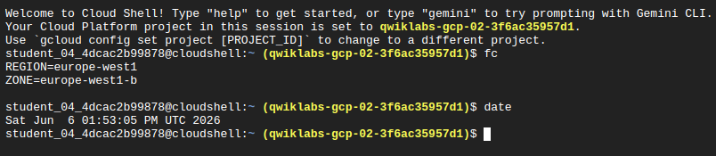

*Figure 1. Set up your environment.*

## Task 1: Create Web Servers

```bash
# ---------------- Task 1: Create Web Servers -------------------
cat > script1.sh <<'EOF_END'
#!/bin/bash
sudo apt-get update
sudo apt-get install apache2 -y
service apache2 restart
echo "<h3>Web Server: web1</h3>" | tee /var/www/html/index.html
EOF_END

cat > script2.sh <<'EOF_END'
#!/bin/bash
sudo apt-get update
sudo apt-get install apache2 -y
service apache2 restart
echo "<h3>Web Server: web2</h3>" | tee /var/www/html/index.html
EOF_END

cat > script3.sh <<'EOF_END'
#!/bin/bash
sudo apt-get update
sudo apt-get install apache2 -y
service apache2 restart
echo "<h3>Web Server: web3</h3>" | tee /var/www/html/index.html
EOF_END


gcloud compute instances create web1 \
    --zone=$ZONE \
    --machine-type=e2-small \
    --tags=network-lb-tag \
    --network=default \
    --image-family=debian-12 \
    --image-project=debian-cloud \
    --metadata-from-file startup-script=script1.sh

gcloud compute instances create web2 \
    --zone=$ZONE \
    --machine-type=e2-small \
    --tags=network-lb-tag \
    --network=default \
    --image-family=debian-12 \
    --image-project=debian-cloud \
    --metadata-from-file startup-script=script2.sh

gcloud compute instances create web3 \
    --zone=$ZONE \
    --machine-type=e2-small \
    --tags=network-lb-tag \
    --network=default \
    --image-family=debian-12 \
    --image-project=debian-cloud \
    --metadata-from-file startup-script=script3.sh


# Firewall for Network LB
gcloud compute firewall-rules create www-firewall-network-lb \
    --allow tcp:80 \
    --network=default \
    --target-tags=network-lb-tag
```

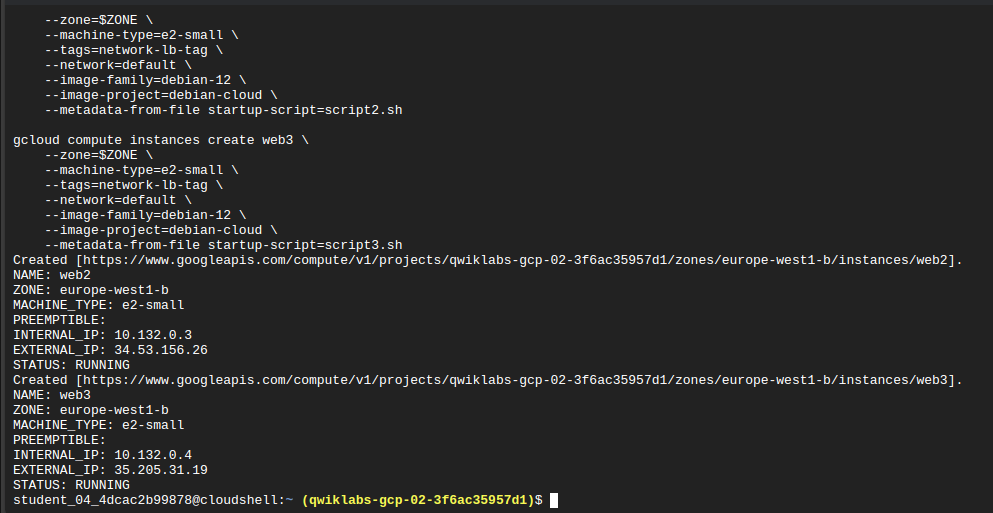

*Figure 2. Create web servers.*

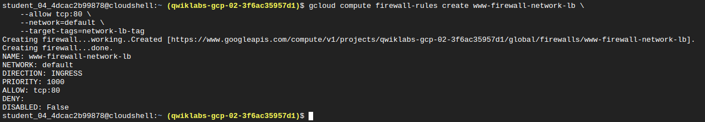

*Figure 3. Create firewall rules.*

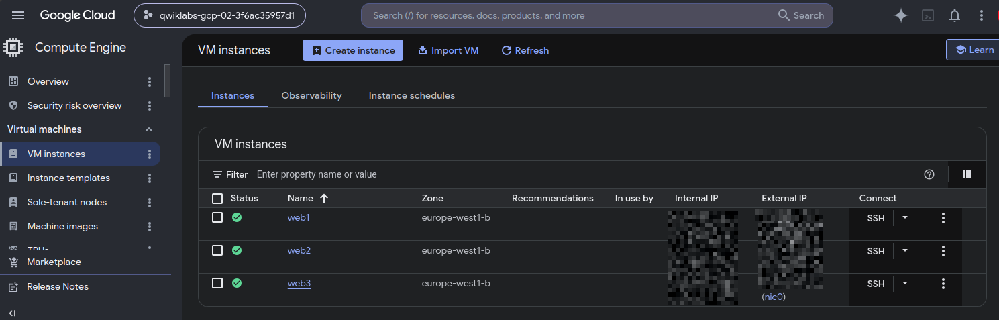

*Figure 4. Check web servers.*

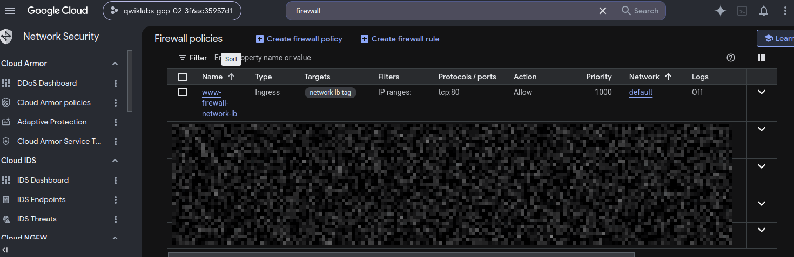

*Figure 5. Check firewall rules.*

## Task 2: Network Load Balancer

```bash
# ---------------- Task 2: Network Load Balancer -------------------

gcloud compute addresses create network-lb-ip-1 \
    --region=$REGION

gcloud compute http-health-checks create basic-check

gcloud compute target-pools create www-pool \
    --region=$REGION \
    --http-health-check basic-check

gcloud compute target-pools add-instances www-pool \
    --instances=web1,web2,web3 \
    --zone=$ZONE

gcloud compute forwarding-rules create www-rule \
    --region=$REGION \
    --ports=80 \
    --address=network-lb-ip-1 \
    --target-pool=www-pool
```

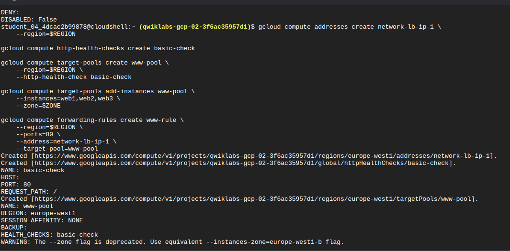

*Figure 6. Create Network Load Balancer.*

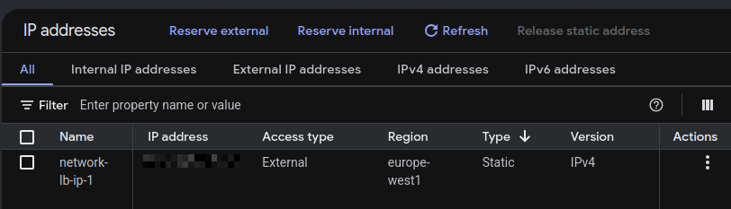

*Figure 7. Check address.*

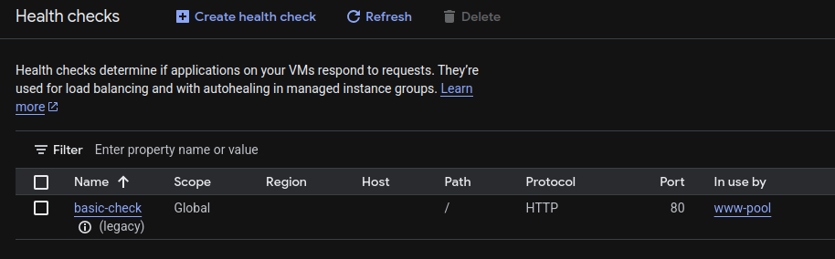

*Figure 8. Check health check.*

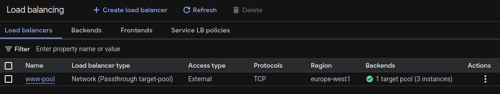

*Figure 9. Check load balancer.*

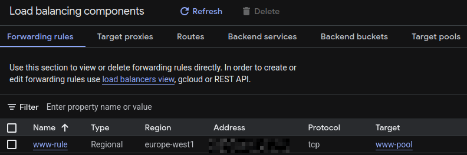

*Figure 10. Check forwarding rule.*

## Task 3: HTTP Load Balancer

```bash
# ---------------- Task 3: HTTP Load Balancer -------------------


cat > script4.sh <<'EOF_END'
#!/bin/bash
sudo apt-get update
sudo apt-get install apache2 -y
vm=\$(hostname)
echo \"Page served from: \$vm\" > /var/www/html/index.html
systemctl restart apache2
EOF_END

# Instance Template
gcloud compute instance-templates create lb-backend-template \
  --machine-type=e2-medium \
  --tags=allow-health-check \
  --image-family=debian-12 \
  --image-project=debian-cloud \
  --metadata-from-file startup-script=script4.sh

# Managed Instance Group
gcloud compute instance-groups managed create lb-backend-group \
  --template=lb-backend-template \
  --size=2 \
  --zone=$ZONE

# Firewall for HC
gcloud compute firewall-rules create fw-allow-health-check \
  --network=default \
  --action=allow \
  --direction=ingress \
  --source-ranges=130.211.0.0/22,35.191.0.0/16 \
  --target-tags=allow-health-check \
  --rules=tcp:80

# Global IP
gcloud compute addresses create lb-ipv4-1 \
  --ip-version=IPV4 \
  --global

# Health check
gcloud compute health-checks create http http-basic-check --port=80

# Backend service
gcloud compute backend-services create web-backend-service \
  --protocol=HTTP \
  --port-name=http \
  --health-checks=http-basic-check \
  --global

gcloud compute backend-services add-backend web-backend-service \
  --instance-group=lb-backend-group \
  --instance-group-zone=$ZONE \
  --global

# URL Map & Proxy
gcloud compute url-maps create web-map-http \
  --default-service web-backend-service

gcloud compute target-http-proxies create http-lb-proxy \
  --url-map=web-map-http

# Forwarding rule
gcloud compute forwarding-rules create http-content-rule \
  --address=lb-ipv4-1 \
  --global \
  --target-http-proxy=http-lb-proxy \
  --ports=80
```

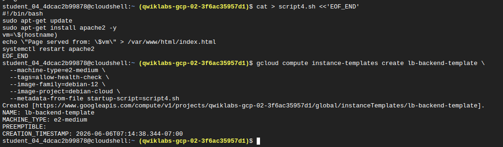

*Figure 11. Create instance template.*

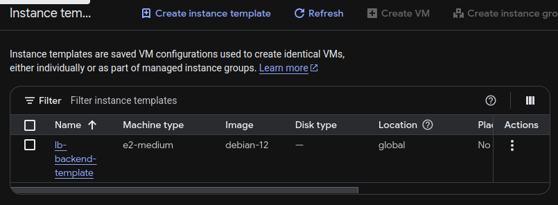

*Figure 12. Check instance template.*

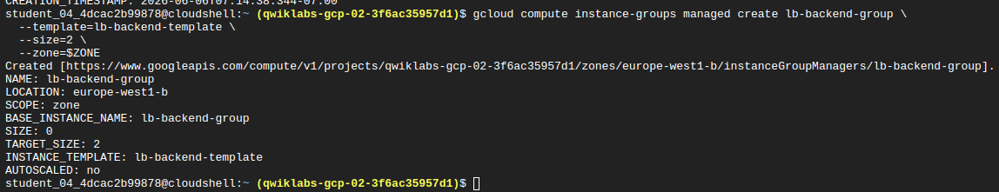

*Figure 13. Create instance groups.*

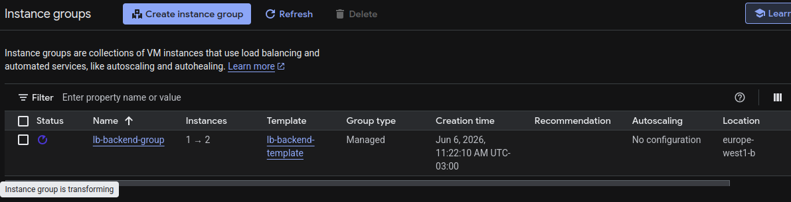

*Figure 14. Check instance groups.*

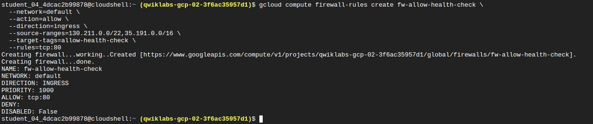

*Figure 15. Create firewall rules.*

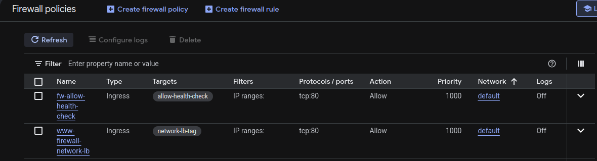

*Figure 16. Check firewall rules.*

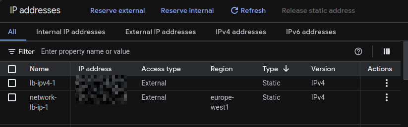

*Figure 17. Create address.*

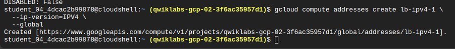

*Figure 18. Check address.*

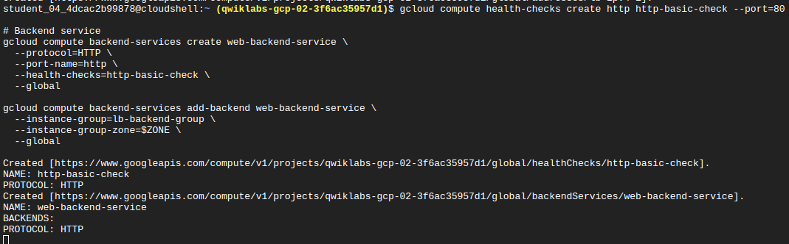

*Figure 19. Create health check and web backend service.*

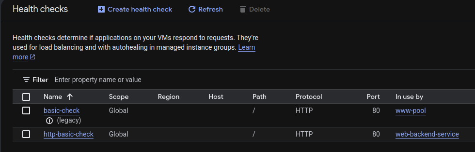

*Figure 20. Check health check.*

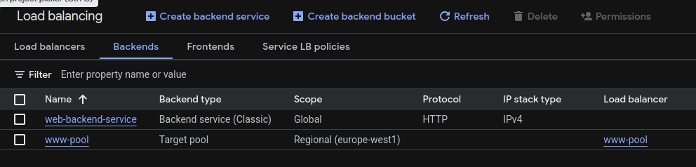

*Figure 21. Check web backend service.*

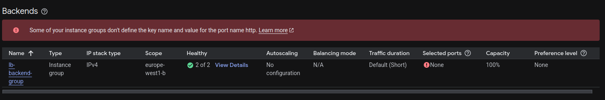

*Figure 22. Detect web backend service error.*

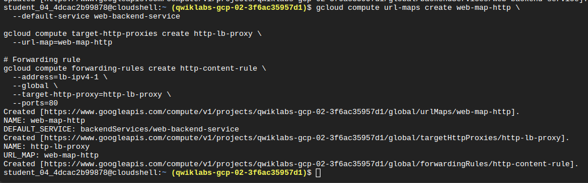

*Figure 23. Create url-map, proxy, and forwarding rule.*

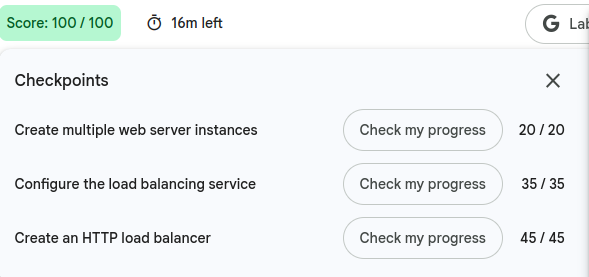

*Figure 24. Check url-map, proxy, and forwarding rule.*
