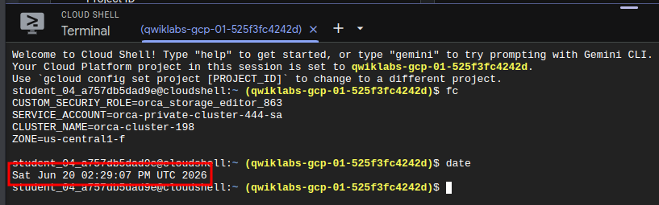
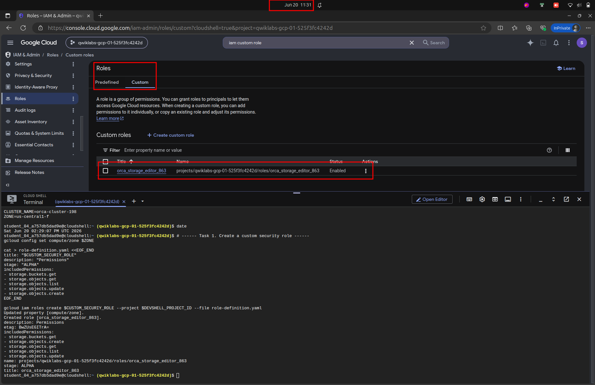
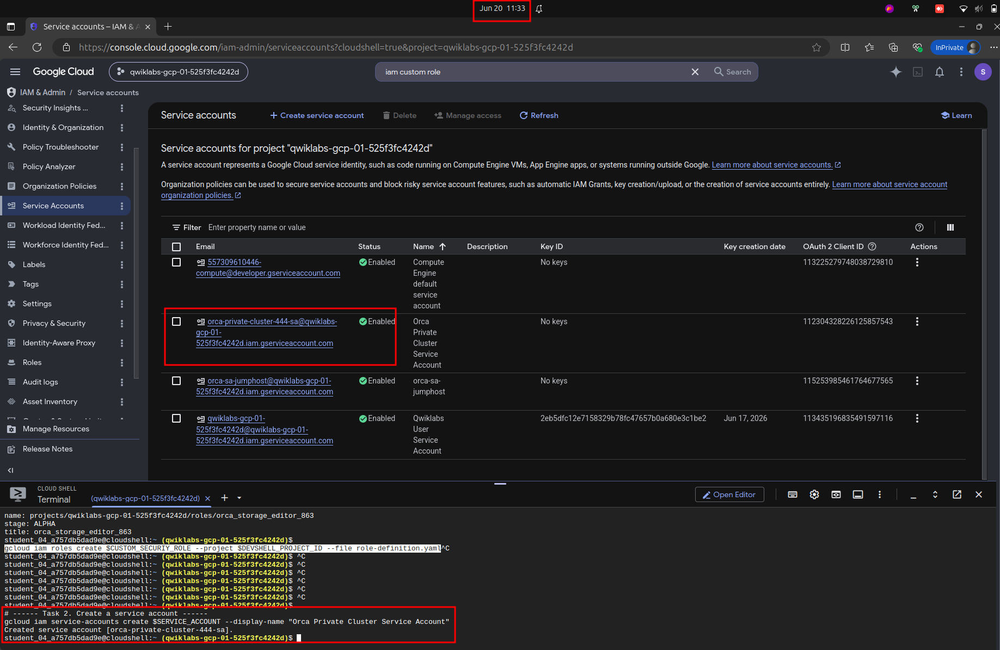
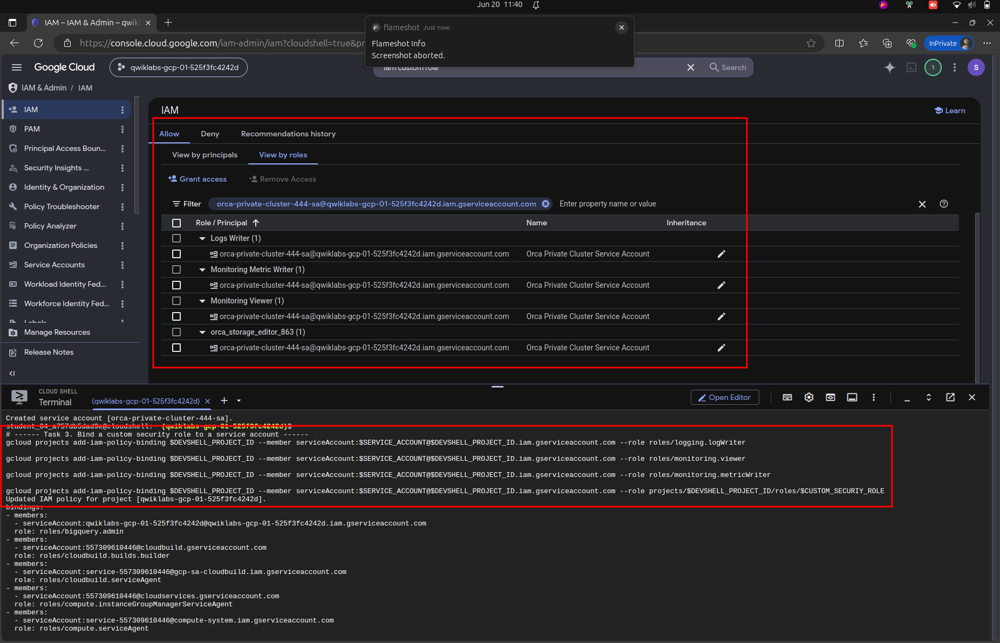
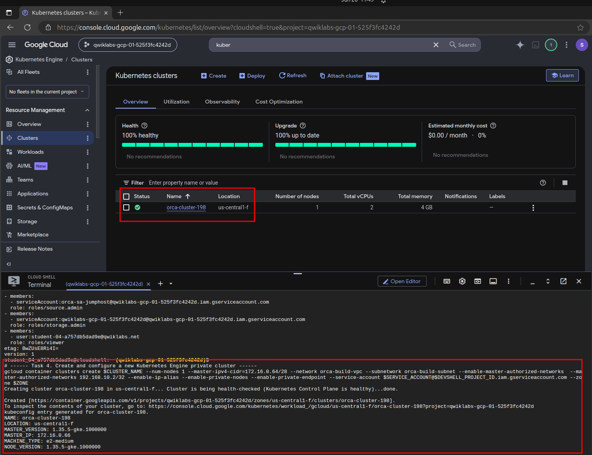
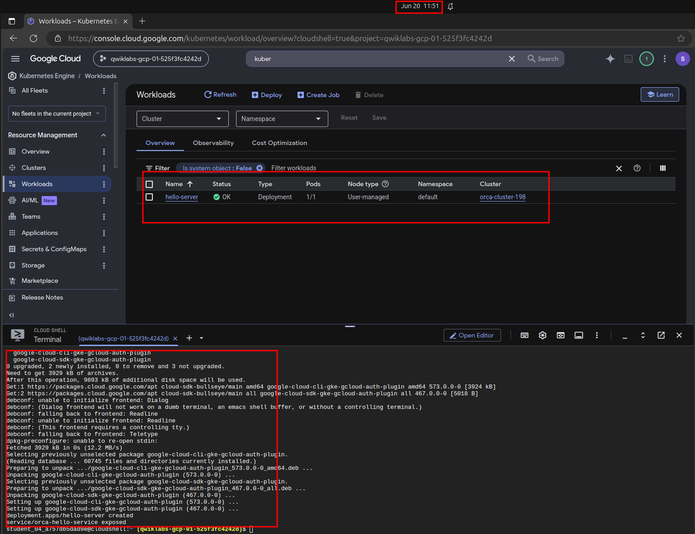
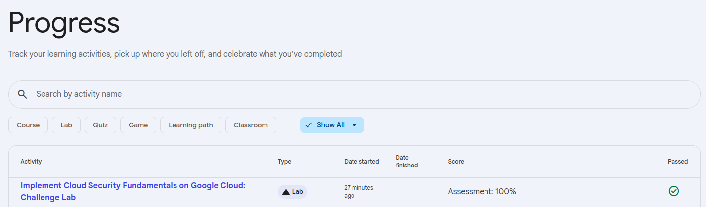

# Implement Cloud Security Fundamentals on Google Cloud: Challenge Lab

## Setup

```bash
CUSTOM_SECURIY_ROLE=
SERVICE_ACCOUNT=
CLUSTER_NAME=
ZONE=
```



*Figure 1. Setup.*


## Task 1. Create a custom security role

```bash
# ------ Task 1. Create a custom security role ------
gcloud config set compute/zone $ZONE

cat > role-definition.yaml <<EOF_END
title: "$CUSTOM_SECURIY_ROLE"
description: "Permissions"
stage: "ALPHA"
includedPermissions:
- storage.buckets.get
- storage.objects.get
- storage.objects.list
- storage.objects.update
- storage.objects.create
EOF_END

gcloud iam roles create $CUSTOM_SECURIY_ROLE --project $DEVSHELL_PROJECT_ID --file role-definition.yaml
```



*Figure 1. Task 1.*


## Task 2. Create a service account

```bash
# ------ Task 2. Create a service account ------
gcloud iam service-accounts create $SERVICE_ACCOUNT --display-name "Orca Private Cluster Service Account"
```



*Figure 1. Task 2.*


## Task 3. Bind a custom security role to a service account

```bash
# ------ Task 3. Bind a custom security role to a service account ------
gcloud projects add-iam-policy-binding $DEVSHELL_PROJECT_ID --member serviceAccount:$SERVICE_ACCOUNT@$DEVSHELL_PROJECT_ID.iam.gserviceaccount.com --role roles/logging.logWriter

gcloud projects add-iam-policy-binding $DEVSHELL_PROJECT_ID --member serviceAccount:$SERVICE_ACCOUNT@$DEVSHELL_PROJECT_ID.iam.gserviceaccount.com --role roles/monitoring.viewer

gcloud projects add-iam-policy-binding $DEVSHELL_PROJECT_ID --member serviceAccount:$SERVICE_ACCOUNT@$DEVSHELL_PROJECT_ID.iam.gserviceaccount.com --role roles/monitoring.metricWriter

gcloud projects add-iam-policy-binding $DEVSHELL_PROJECT_ID --member serviceAccount:$SERVICE_ACCOUNT@$DEVSHELL_PROJECT_ID.iam.gserviceaccount.com --role projects/$DEVSHELL_PROJECT_ID/roles/$CUSTOM_SECURIY_ROLE
```



*Figure 1. Task 3.*


## Task 4. Create and configure a new Kubernetes Engine private cluster

```bash
# ------ Task 4. Create and configure a new Kubernetes Engine private cluster ------
gcloud container clusters create $CLUSTER_NAME --num-nodes 1 --master-ipv4-cidr=172.16.0.64/28 --network orca-build-vpc --subnetwork orca-build-subnet --enable-master-authorized-networks  --master-authorized-networks 192.168.10.2/32 --enable-ip-alias --enable-private-nodes --enable-private-endpoint --service-account $SERVICE_ACCOUNT@$DEVSHELL_PROJECT_ID.iam.gserviceaccount.com --zone $ZONE
```



*Figure 1. Task 4.*


## Task 5. Deploy an application to a private Kubernetes Engine cluster

```bash
# ------ Task 5. Deploy an application to a private Kubernetes Engine cluster ------
gcloud compute ssh --zone "$ZONE" "orca-jumphost" --project "$DEVSHELL_PROJECT_ID" --quiet --command "gcloud config set compute/zone $ZONE && gcloud container clusters get-credentials $CLUSTER_NAME --internal-ip && sudo apt-get install -y google-cloud-sdk-gke-gcloud-auth-plugin && kubectl create deployment hello-server --image=gcr.io/google-samples/hello-app:1.0 && kubectl expose deployment hello-server --name orca-hello-service --type LoadBalancer --port 80 --target-port 8080"
```



*Figure 1. Task 5.*



*Figure 1. End the lab.*
