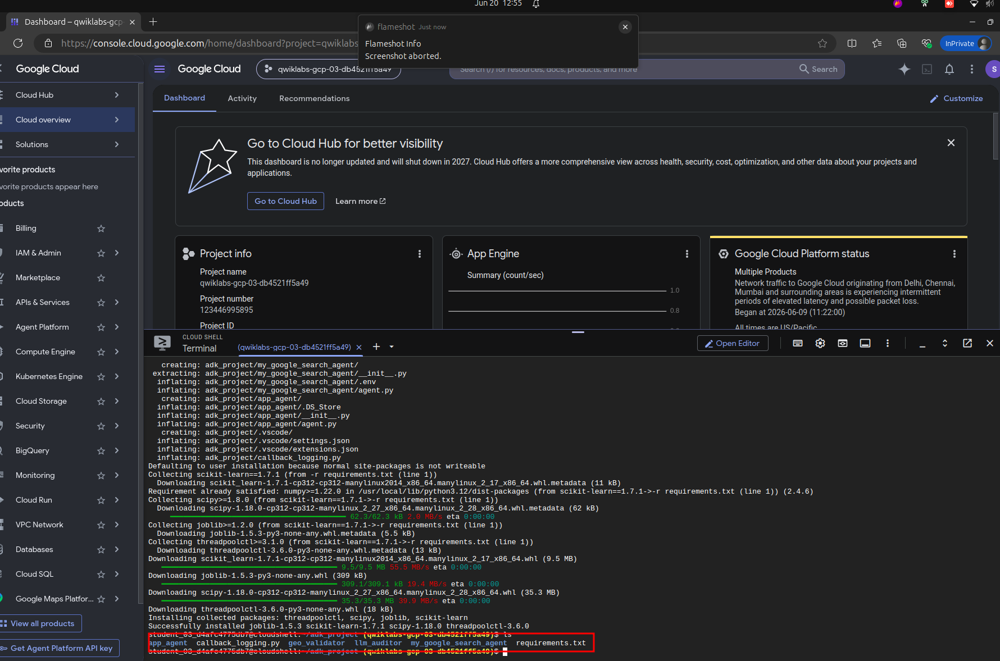
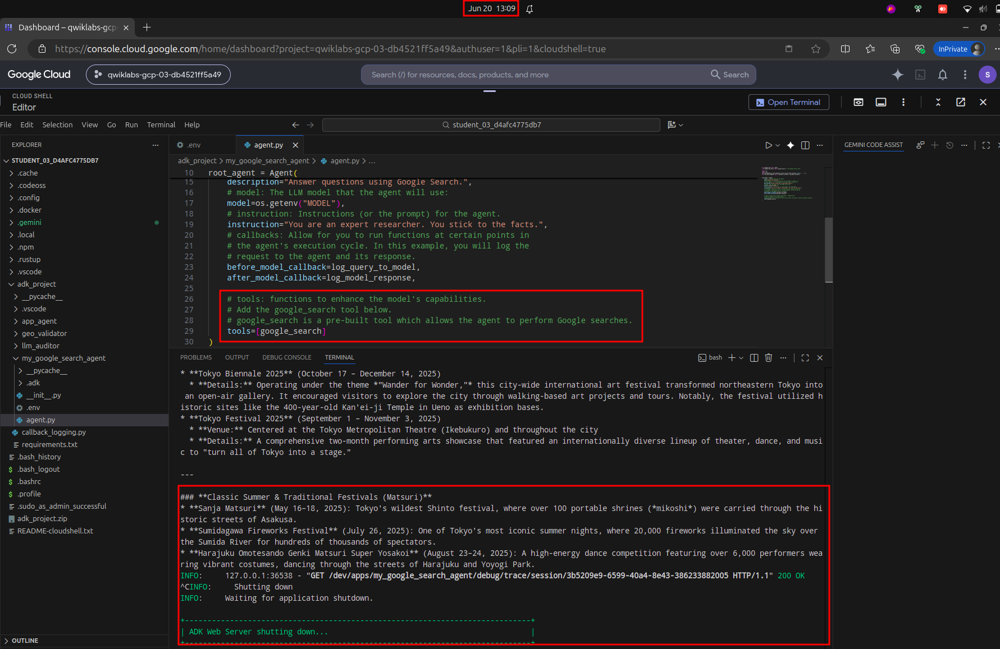
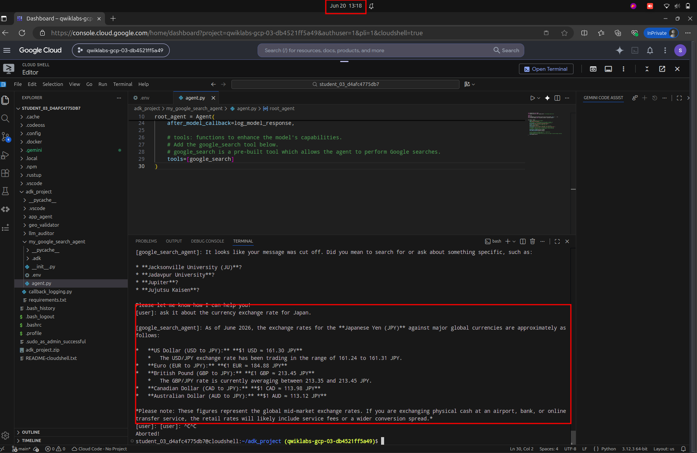
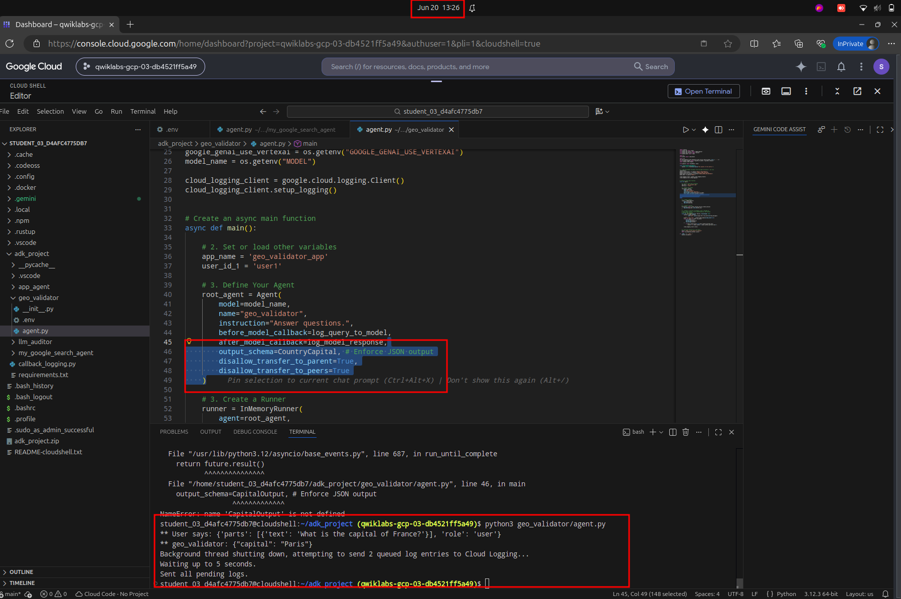
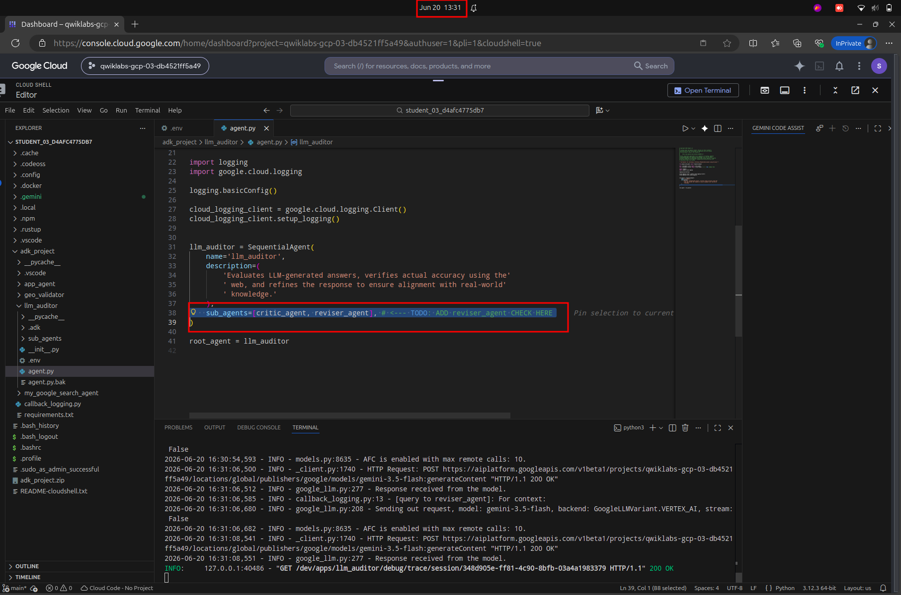
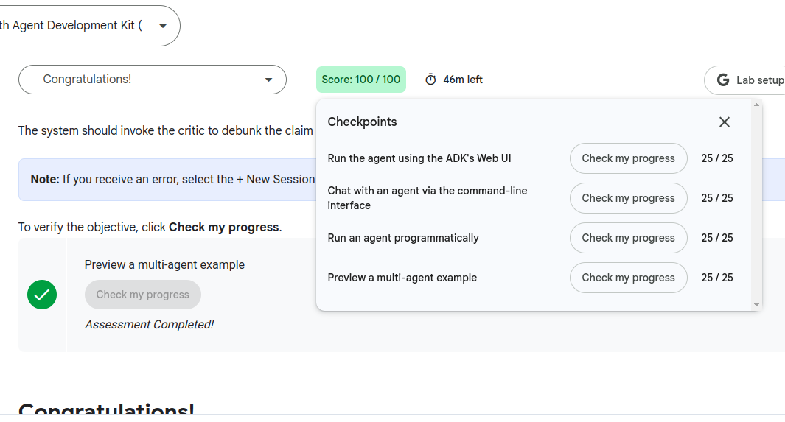

# Engineer AI Agents with Agent Development Kit (ADK): Challenge Lab

## Task 1. Install ADK and set up your environment

```bash
#------ Task 1. Install ADK and set up your environment ------
export PATH=$PATH:"/home/${USER}/.local/bin"
python3 -m pip install google-adk
gcloud auth application-default login
gcloud storage cp gs://$DEVSHELL_PROJECT_ID-bucket/adk_project.zip .
unzip adk_project.zip
cd adk_project
pip install -r requirements.txt
```



*Figure 1. Task 1.*


## Task 2. Initialize and Configure the Travel Scout

```bash
#------ Task 2. Initialize and Configure the Travel Scout ------

#.env
GOOGLE_GENAI_USE_ENTERPRISE=true
GOOGLE_CLOUD_PROJECT=
GOOGLE_CLOUD_LOCATION=global
MODEL=model_name

# Modify agent.py
    # tools: functions to enhance the model's capabilities.
    # Add the google_search tool below.
    # google_search is a pre-built tool which allows the agent to perform Google searches.
    tools=[google_search]

# Launch
cd ~/adk_project
adk web --allow_origins "regex:https://.*\.cloudshell\.dev"
```




*Figure 1. Task 2.*


## Task 3. Verify the agent via the CLI

```bash
#------ Task 3. Verify the agent via the CLI ------
cd ~/adk_project
adk run my_google_search_agent

```




*Figure 1. Task 3.*


## Task 4. Enforce structured standards

```bash
#------ Task 4. Enforce structured standards ------
cd ~/adk_project/geo_validator

#.env
GOOGLE_GENAI_USE_ENTERPRISE=true
GOOGLE_CLOUD_PROJECT=
GOOGLE_CLOUD_LOCATION=global
MODEL=model_name

# Modify agent.py
from pydantic import BaseModel, Field

class CountryCapital(BaseModel):
    capital: str = Field(description="The capital of the country.")

...
        output_schema=CountryCapital, # Enforce JSON output
        disallow_transfer_to_parent=True,
        disallow_transfer_to_peers=True
# Launch
python3 geo_validator/agent.py
```



*Figure 1. Task 4.*


## Task 5. Deploy the Brochure Auditor

```bash
#------ Task 5. Deploy the Brochure Auditor ------
cd ~/adk_project/llm_auditor

#.env
GOOGLE_GENAI_USE_ENTERPRISE=true
GOOGLE_CLOUD_PROJECT=
GOOGLE_CLOUD_LOCATION=global
MODEL=model_name

# Modify agent.py to enable the google_search tool. (Tip: Pass tools=[google_search] in the Agent definition).

# Launch
cd ~/adk_project
adk web --allow_origins "regex:https://.*\.cloudshell\.dev" 
```



*Figure 1. Task 5.*



*Figure 1. End the lab.*
