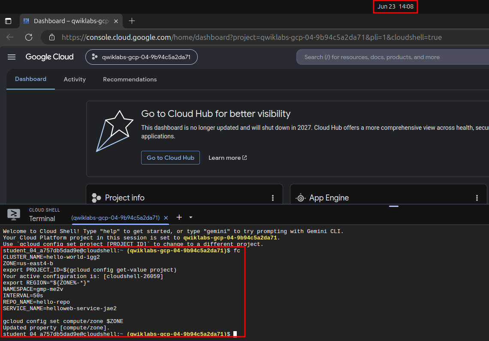
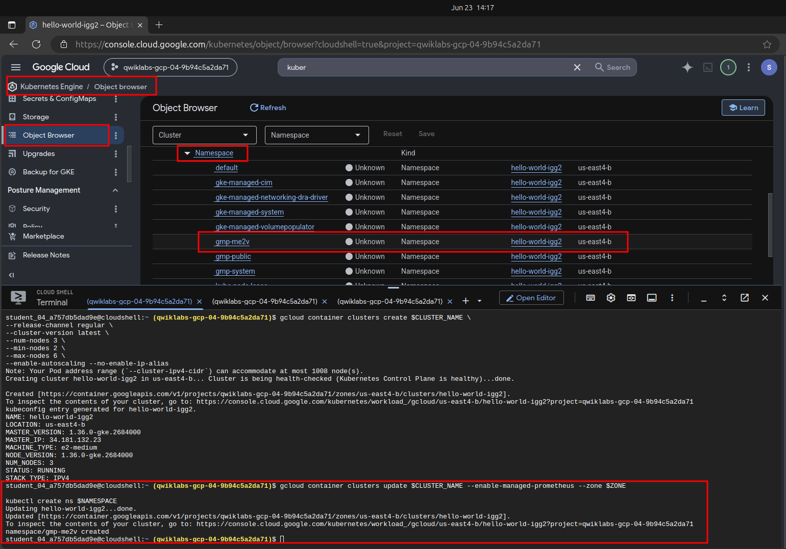
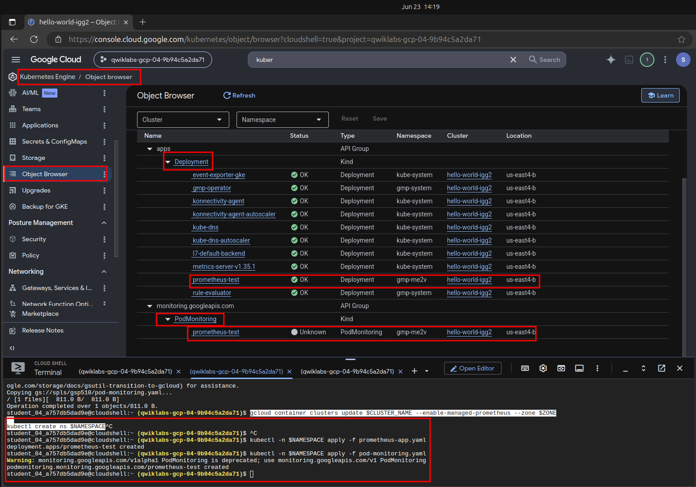
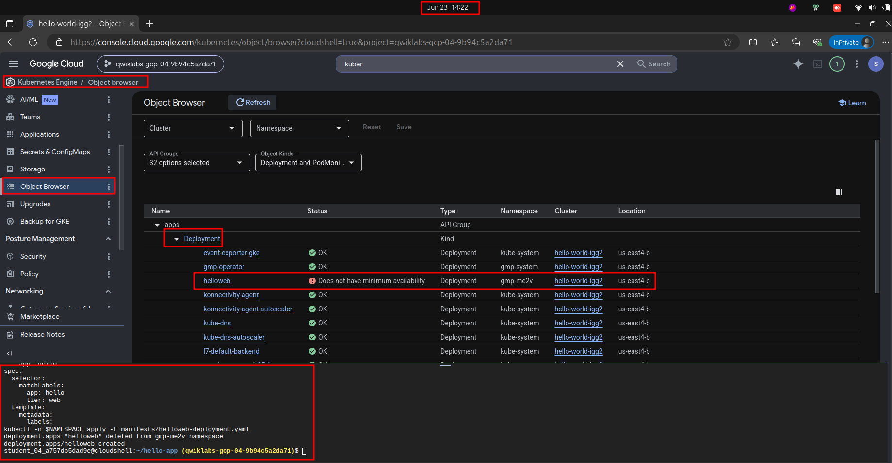
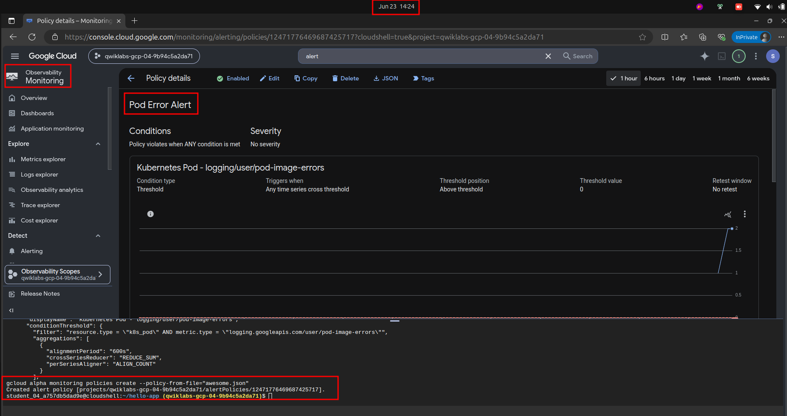
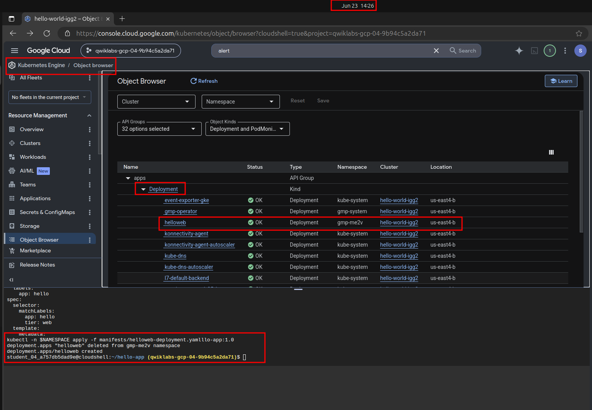
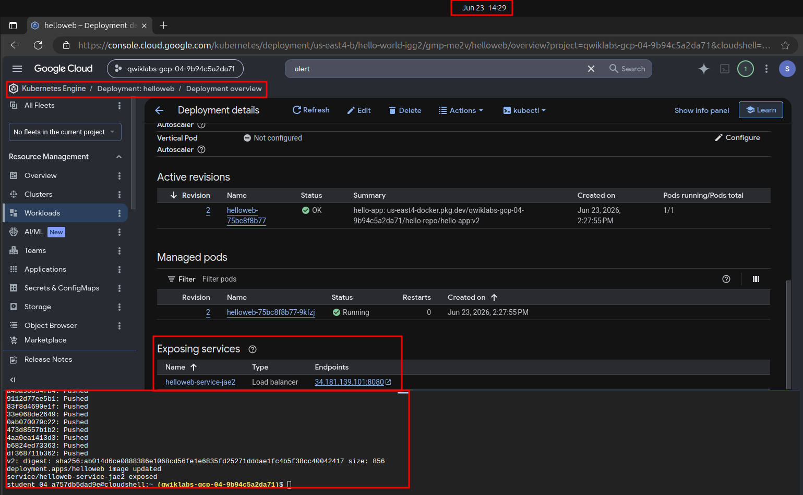
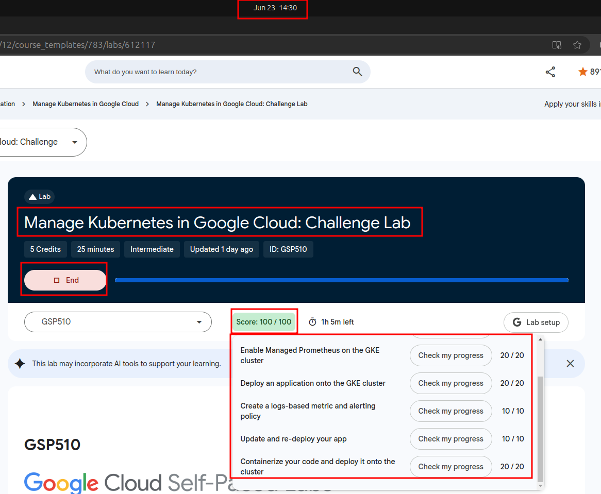

# Manage Kubernetes in Google Cloud: Challenge Lab

## Setup

```bash
CLUSTER_NAME=
ZONE=
export PROJECT_ID=$(gcloud config get-value project)
export REGION="${ZONE%-*}"
NAMESPACE=
INTERVAL=
REPO_NAME=
SERVICE_NAME=

gcloud config set compute/zone $ZONE
```



*Figure 1. Setup.*


## Task 1. Create a GKE cluster

```bash
#------ Task 1. Create a GKE cluster ------
gcloud container clusters create $CLUSTER_NAME \
--release-channel regular \
--cluster-version latest \
--num-nodes 3 \
--min-nodes 2 \
--max-nodes 6 \
--enable-autoscaling --no-enable-ip-alias

gcloud container clusters update $CLUSTER_NAME --enable-managed-prometheus --zone $ZONE
  
kubectl create ns $NAMESPACE
```



*Figure 1. Task 1.*


## Task 2. Enable Managed Prometheus on the GKE cluster

```bash
#------ Task 2. Enable Managed Prometheus on the GKE cluster ------
  
gsutil cp gs://spls/gsp510/prometheus-app.yaml .
 
cat > prometheus-app.yaml <<EOF

apiVersion: apps/v1
kind: Deployment
metadata:
  name: prometheus-test
  labels:
    app: prometheus-test
spec:
  selector:
    matchLabels:
      app: prometheus-test
  replicas: 3
  template:
    metadata:
      labels:
        app: prometheus-test
    spec:
      nodeSelector:
        kubernetes.io/os: linux
        kubernetes.io/arch: amd64
      containers:
      - image: nilebox/prometheus-example-app:latest
        name: prometheus-test
        ports:
        - name: metrics
          containerPort: 1234
        command:
        - "/main"
        - "--process-metrics"
        - "--go-metrics"
EOF

 
kubectl -n $NAMESPACE apply -f prometheus-app.yaml

gsutil cp gs://spls/gsp510/pod-monitoring.yaml .
 
cat > pod-monitoring.yaml <<EOF

apiVersion: monitoring.googleapis.com/v1alpha1
kind: PodMonitoring
metadata:
  name: prometheus-test
  labels:
    app.kubernetes.io/name: prometheus-test
spec:
  selector:
    matchLabels:
      app: prometheus-test
  endpoints:
  - port: metrics
    interval: $INTERVAL
EOF

  
kubectl -n $NAMESPACE apply -f pod-monitoring.yaml
  
```



*Figure 1. Task 2.*


## Task 3. Deploy an application onto the GKE cluster

```bash
#------ Task 3. Deploy an application onto the GKE cluster ------
gsutil cp -r gs://spls/gsp510/hello-app/ .
  
export PROJECT_ID=$(gcloud config get-value project)
export REGION="${ZONE%-*}"
cd ~/hello-app
gcloud container clusters get-credentials $CLUSTER_NAME --zone $ZONE
kubectl -n $NAMESPACE apply -f manifests/helloweb-deployment.yaml

cd manifests/

cat > helloweb-deployment.yaml <<EOF
apiVersion: apps/v1
kind: Deployment
metadata:
  name: helloweb
  labels:
    app: hello
spec:
  selector:
    matchLabels:
      app: hello
      tier: web
  template:
    metadata:
      labels:
        app: hello
        tier: web
    spec:
      containers:
      - name: hello-app
        image: <todo>
        ports:
        - containerPort: 8080
        resources:
          requests:
            cpu: 200m
---
EOF
 
cd ..

kubectl delete deployments helloweb  -n $NAMESPACE
kubectl -n $NAMESPACE apply -f manifests/helloweb-deployment.yaml
```



*Figure 1. Task 3.*


## Task 4. Create a logs-based metric and alerting policy

```bash
#------ Task 4. Create a logs-based metric and alerting policy ------

kubectl -n $NAMESPACE apply -f pod-monitoring.yaml

gcloud logging metrics create pod-image-errors \
  --description="awesome lab" \
  --log-filter="resource.type=\"k8s_pod\"	
severity=WARNING"

cat > awesome.json <<EOF_END
{
  "displayName": "Pod Error Alert",
  "userLabels": {},
  "conditions": [
    {
      "displayName": "Kubernetes Pod - logging/user/pod-image-errors",
      "conditionThreshold": {
        "filter": "resource.type = \"k8s_pod\" AND metric.type = \"logging.googleapis.com/user/pod-image-errors\"",
        "aggregations": [
          {
            "alignmentPeriod": "600s",
            "crossSeriesReducer": "REDUCE_SUM",
            "perSeriesAligner": "ALIGN_COUNT"
          }
        ],
        "comparison": "COMPARISON_GT",
        "duration": "0s",
        "trigger": {
          "count": 1
        },
        "thresholdValue": 0
      }
    }
  ],
  "alertStrategy": {
    "autoClose": "604800s"
  },
  "combiner": "OR",
  "enabled": true,
  "notificationChannels": []
}
EOF_END

gcloud alpha monitoring policies create --policy-from-file="awesome.json"

```



*Figure 1. Task 4.*


## Task 5. Update and re-deploy your app

```bash
#------ Task 5. Update and re-deploy your app ------
cd manifests/

cat > helloweb-deployment.yaml <<EOF
apiVersion: apps/v1
kind: Deployment
metadata:
  name: helloweb
  labels:
    app: hello
spec:
  selector:
    matchLabels:
      app: hello
      tier: web
  template:
    metadata:
      labels:
        app: hello
        tier: web
    spec:
      containers:
      - name: hello-app
        image: us-docker.pkg.dev/google-samples/containers/gke/hello-app:1.0
        ports:
        - containerPort: 8080
        resources:
          requests:
            cpu: 200m
---
EOF
 
cd ..

kubectl delete deployments helloweb  -n $NAMESPACE
kubectl -n $NAMESPACE apply -f manifests/helloweb-deployment.yaml
```



*Figure 1. Task 5.*


## Task 6. Containerize your code and deploy it onto the cluster

```bash
#------ Task 6. Containerize your code and deploy it onto the cluster ------
export PROJECT_ID=$(gcloud config get-value project)
export REGION="${ZONE%-*}"
cd ~/hello-app/

gcloud auth configure-docker $REGION-docker.pkg.dev --quiet
docker build -t $REGION-docker.pkg.dev/$PROJECT_ID/$REPO_NAME/hello-app:v2 .
 
docker push $REGION-docker.pkg.dev/$PROJECT_ID/$REPO_NAME/hello-app:v2
  
kubectl set image deployment/helloweb -n $NAMESPACE hello-app=$REGION-docker.pkg.dev/$PROJECT_ID/$REPO_NAME/hello-app:v2
  
kubectl expose deployment helloweb -n $NAMESPACE --name=$SERVICE_NAME --type=LoadBalancer --port 8080 --target-port 8080
 
cd ..
```



*Figure 1. Task 6.*




*Figure 1. End the lab.*
